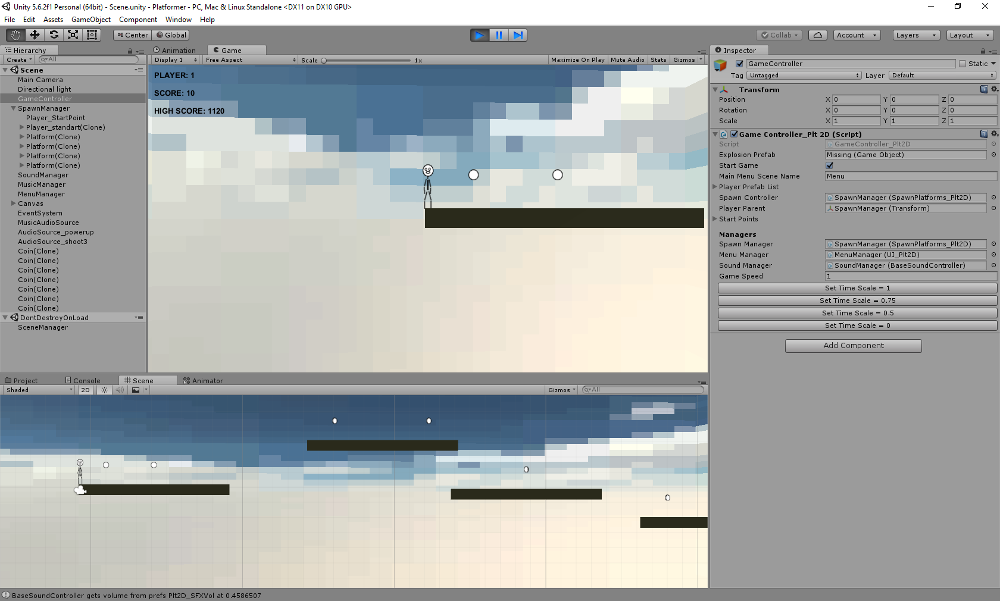

# Platformer2D (simple platformer 2D)

## Task:
1) It is necessary to implement 2D game (style: platformer) using primitive 2D or 3D objects. Must be a player
 that can be controlled with the keys: a, d - movement back, forward, space - jump. There should be a platform
 on which the player must jump, which should be placed randomly at certain distances, but that the player could
 pass the level.
2) Realize the selection of bonuses placed on platforms (also simple objects), while selecting add +10 bonuses.
3) It is necessary to store a record number of bonuses collected at the finished level.
4) On the player screen, show the bonuses received at the current level and the highest record of the bonuses
 received at previous levels (saved data).
5) Game need to have two scenes: Menu, Basic.

Additional tasks:
1) Add something interesting in the game, if desired.
2) Realize the sounds in the game.
3) Realize music in the game.

## Implemented:
All

Additional:
1) falling platforms after one second how the player touched her
2) sounds of picking up bonuses
3) music in the game

## Unity 5.6.2

